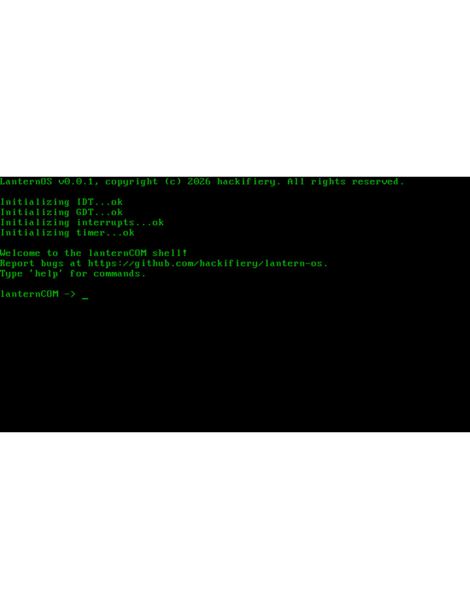
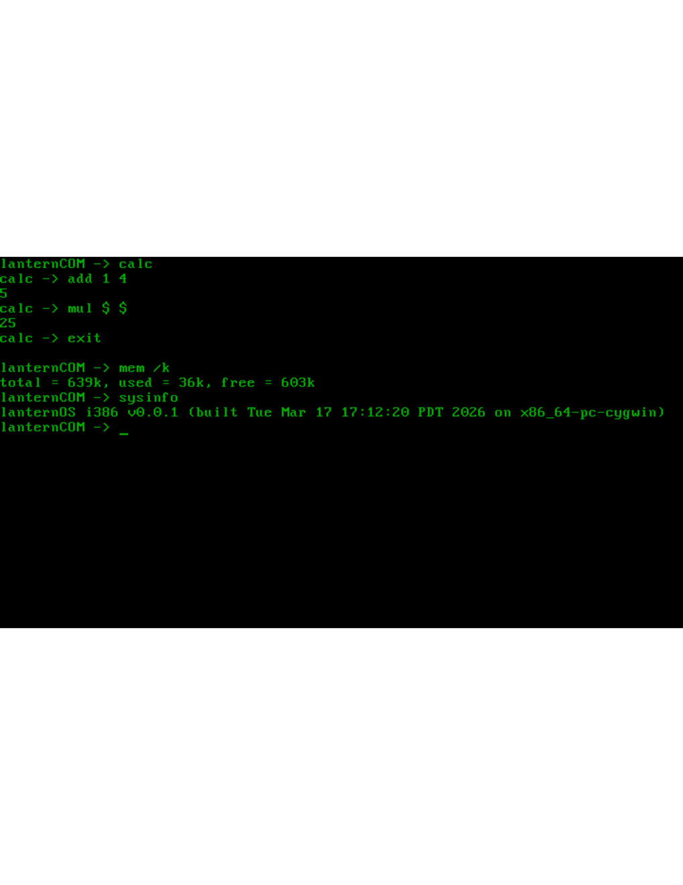
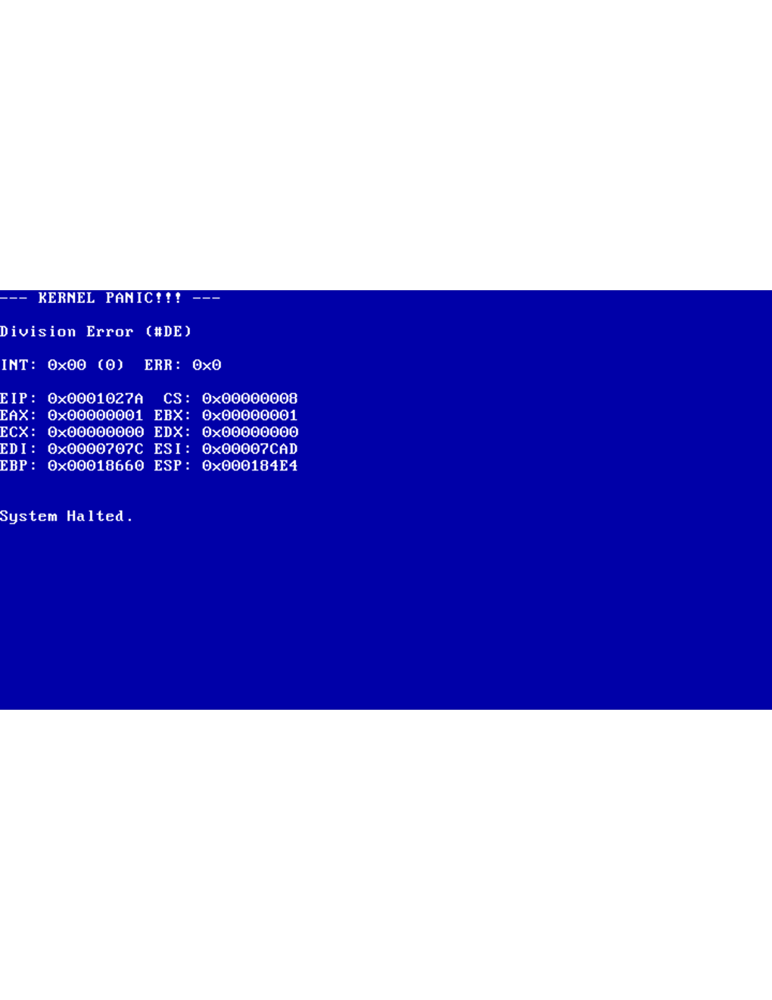

# LanternOS
LanternOS is a hobbyist OS and kernel made by me to explore how OS's work. It currently has an IDT, a basic GDT, IRQ and ISRs, and a basic keyboard and VGA text-mode driver. It also uses a custom bootloader called Lightbulb.
## lanternCOM
lanternCOM is the basic shell for LanternOS. It only has a couple of commands so far.

- `help`: Lists all available commands in the current build.
- `echo [text]`: Repeats the provided string back to the console.
- `cls`: Clears the video buffer and resets the cursor position.
- `ping`: Prints "Pong!".
- `sysinfo`: Displays the current OS version, build date, and target architecture.
- `mem [flag]`: Reports memory statistics (not very accurate).
    - `/m`=mb, `/k`=kb, `/b`=bytes, `/g`=gb, no flag=kb
- `panic [code]`: Triggers a kernel panic with an optional fault code.
- `reboot` and `shutdown`: self-explanitory

## Screenshots

